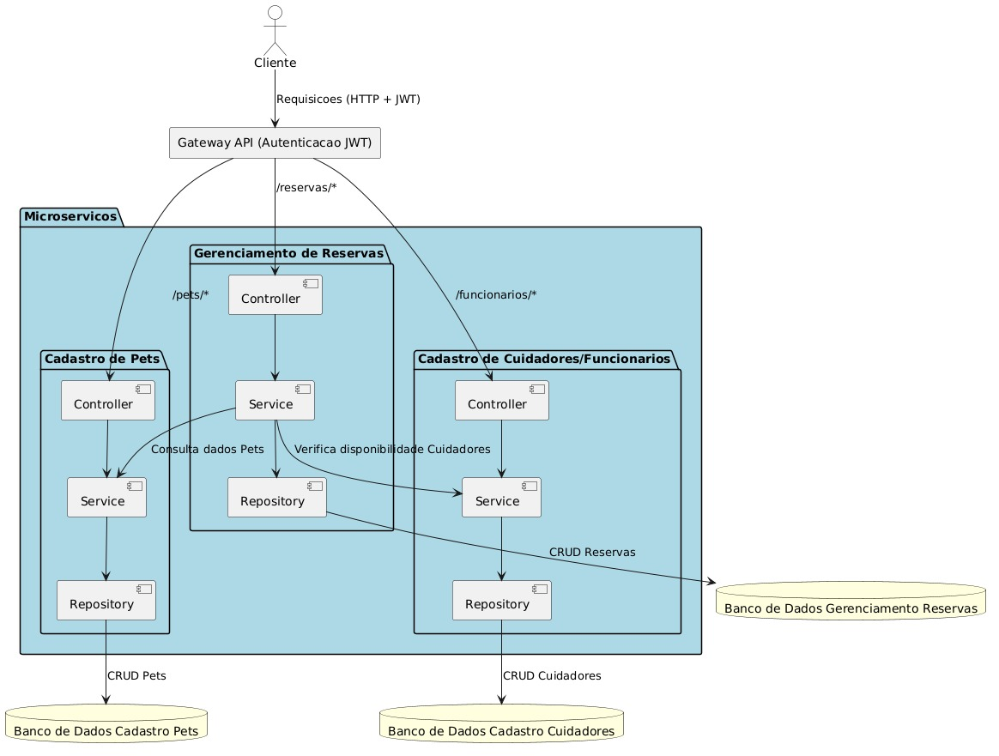

# Sistema de Hotel para Pets - AUQMIA

O **AUQMIA** é um sistema de gerenciamento de hospedagem para pets, desenvolvido com uma arquitetura de microserviços. O objetivo principal é organizar de forma eficiente as informações de pets hospedados, cuidadores e reservas.

---

## 📐 Arquitetura do Projeto



### 🛠️ Microserviços

1. **Cadastro de Pets**
   - Gerencia as informações de cada pet:
     - Nome do pet
     - Gênero
     - Castrado (Sim/Não)
     - Idade
     - Espécie
     - Restrição/Comorbidade
     - Nome do tutor
     - Contato 1 do tutor
     - Contato 2 do tutor
     - Endereço
     - Outros detalhes

2. **Cadastro de Cuidadores/Funcionários**
   - Gerencia as informações dos cuidadores:
     - Nome
     - Agenda
     - Função
     - Horários de trabalho

3. **Gerenciamento de Reservas**
   - Funcionalidades:
     - Criação de reservas
     - Cancelamento de reservas
     - Listagem de reservas
     - Atualização de reservas
     - Verificação de disponibilidade de datas
     - Verificação de disponibilidade de cuidadores
     - Regra de alocação de cuidadores (1 cuidador para cada 5 pets)

---

### 🔄 Fluxo de Dados Entre os Microserviços

1. **Cadastro de um Pet**
   - O microserviço **CadastroPet** registra o agendamento.
   - O **GerenciamentoReserva** consulta cuidadores disponíveis para a data.
   - As reservas são confirmadas ou novas verificações são realizadas.
   - Reservas são atualizadas automaticamente quando canceladas ou modificadas.

---

### 🔑 Mecanismo de Autenticação

- Implementado com **JSON Web Tokens (JWT)** para autenticar usuários (secretária e administrador), garantindo acesso seguro ao sistema.

---

### 🗄️ Mecanismo de Persistência

- **CadastroPet** e **CadastroCuidador**: Banco de dados H2 para garantir consistência e integridade dos dados.
- **GerenciamentoReserva**: Banco de dados H2 para consultas rápidas e eficientes.

---

### 🛠️ Tecnologias Utilizadas

- **Linguagens**: Java e JavaScript
- **Framework**: Spring Boot
- **Banco de Dados**: H2
- **Autenticação**: JSON Web Tokens (JWT)
- **Swagger**: Swagger para documentação da api

---

## 🚀 Como Executar o Projeto em Máquina Local

1. **Clone o Repositório**  
   ```bash
   git clone https://github.com/seu-usuario/seu-repositorio.git
   cd seu-repositorio
   ```

2. **Instale o Maven**  
   Certifique-se de que o Maven está instalado na sua máquina. [Download Maven](https://maven.apache.org/download.cgi).

3. **Compile e Instale as Dependências**  
   Navegue até o diretório de cada microserviço e execute:  
   ```bash
   mvn clean install
   ```

4. **Configure o Banco de Dados**  
   Verifique as propriedades de conexão no arquivo `application.properties` de cada microserviço para utilizar o H2.  
   Exemplo de configuração:
   ```properties
   spring.datasource.url=jdbc:h2:mem:cadastropetdb
   spring.datasource.driverClassName=org.h2.Driver
   spring.datasource.username=cadastro
   spring.datasource.password=pet
   spring.h2.console.enabled=true
   ```

5. **Execute os Microserviços**  
   Navegue até o diretório de cada microserviço e execute:  
   ```bash
   mvn spring-boot:run
   ```

6. **Acesse os Endpoints**  
   Após os microserviços estarem em execução, utilize as seguintes URLs:  
   - **Cadastro de Pets**: `http://localhost:8080/pets`
   - **Cadastro de Cuidadores/Funcionarios**: `http://localhost:8081/api/funcionarios`
   - **Gerenciamento de Reservas**: `http://localhost:8082/reservas`
   - **Api Gateway**: `http://localhost:8079/reservas`

---

## ✅ Funcionalidades Implementadas

### **Cadastro de Pets**
- Armazenamento e gerenciamento de informações como:
  - Nome, gênero, idade, espécie, tutor e contatos, entre outros.

### **Cadastro de Cuidadores/Funcionários**
- Gerenciamento de:
  - Nome, agenda, função e horários de trabalho.

### **Gerenciamento de Reservas**
- Criação, cancelamento, listagem e atualização de reservas.

---

## 🚧 Funcionalidades Não Implementadas

- Autenticação com JSON Web Tokens (JWT).

---
